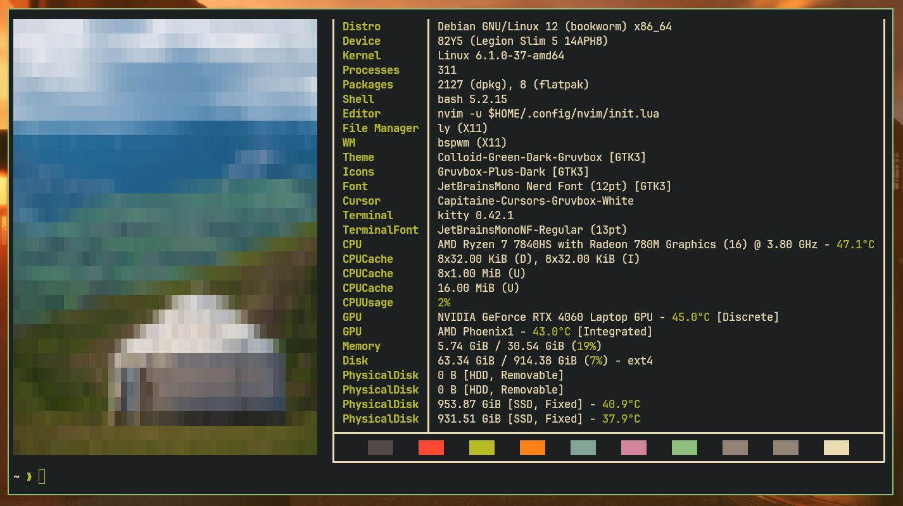
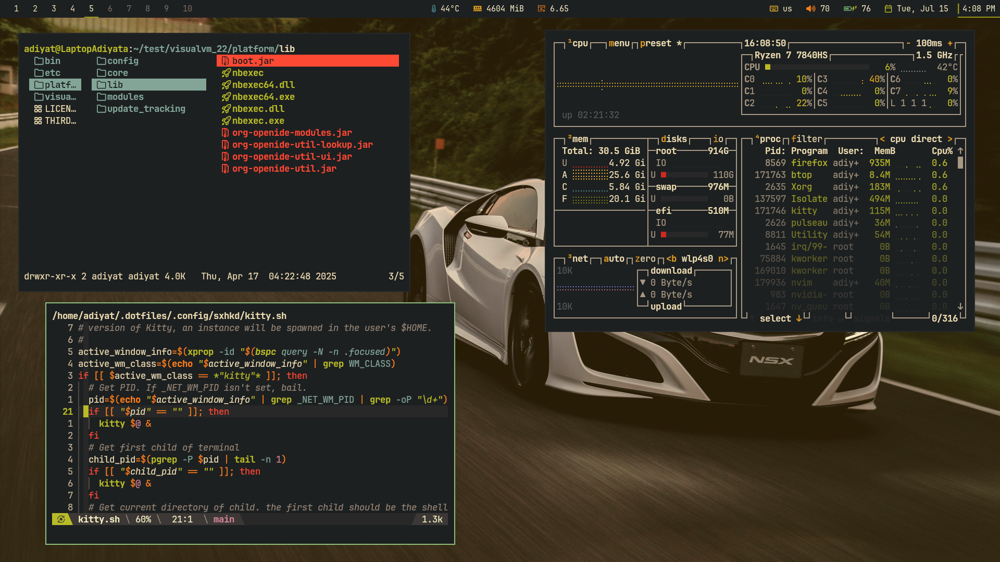
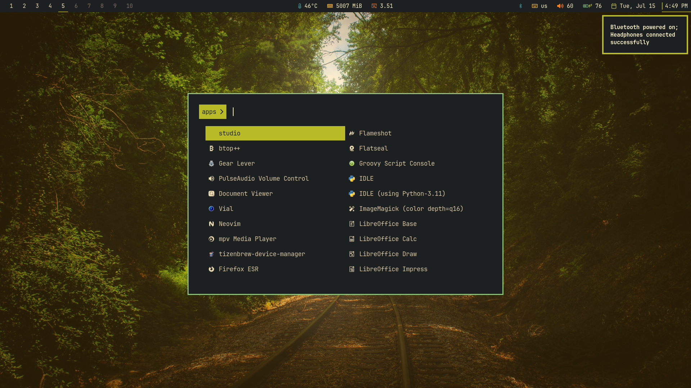
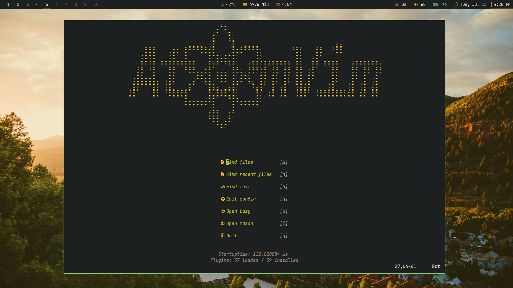
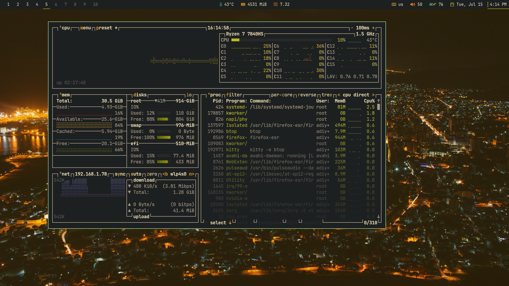
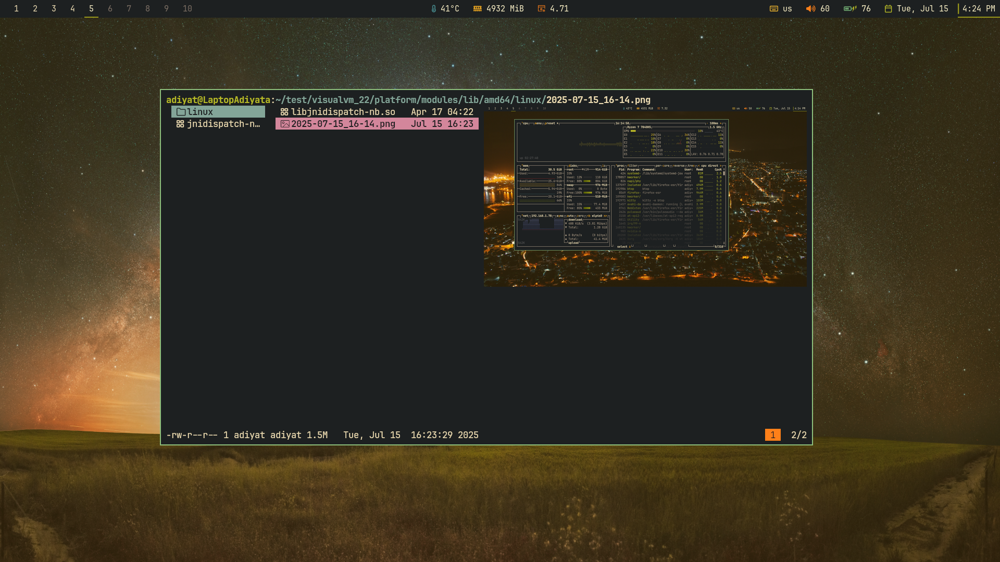

<h1 align="center">:penguin: dotfiles</h1>

<h2>:green_book: About</h2>

- OS: [****`Debian Bookworm`****](https://www.debian.org/releases/bookworm/)
- Shell: [**`Bash`**](https://www.gnu.org/software/bash/)
- Custom Shell Prompt: [**`Oh My Posh`**](https://ohmyposh.dev/)
- Terminal: [**`Kitty`**](https://sw.kovidgoyal.net/kitty/)
- Main Code Editor: [**`Neovim`**](https://neovim.io/)*
- Window Manager: [**`BSPWM`**](https://github.com/baskerville/bspwm)
- Status Bar: [**`Lemonbar`**](https://gitlab.com/protesilaos/lemonbar-xft)** with [**`Succade`**](https://github.com/domsson/succade)
- Lockscreen Software: [**`i3lock-color`**](https://github.com/Raymo111/i3lock-color)
- Hotkey Daemon: [**`Sxhkd`**](https://github.com/baskerville/sxhkd)
- App Launcher: [**`Rofi`**](https://github.com/davatorium/rofi)
- File Manager: [**`LF`**](https://github.com/gokcehan/lf)
- Notification Daemon: [**`Dunst`**](https://github.com/dunst-project/dunst)
- System Monitoring: [**`Btop`**](https://github.com/aristocratos/btop)
- System Info Fetch Software: [**`Fastfetch`**](https://github.com/fastfetch-cli/fastfetch)
- Media Player: [**`MPV`**](https://mpv.io/)
- Screenshot Tool: [**`Flameshot`**](https://flameshot.org/)
- Main Font: [**`JetBrainsMono Nerd Font`**](https://github.com/ryanoasis/nerd-fonts)
- GTK Icon Theme: [**`Gruvbox Plus Dark`**](https://github.com/SylEleuth/gruvbox-plus-icon-pack)
- GTK Theme: [**`Colloid Green Dark Gruvbox`**](https://github.com/vinceliuice/Colloid-gtk-theme)

* - I use Neovim with my own config, no forks. 

> Important:
> Neovim config is stored on another repo [**AtomVim**](https://github.com/bearbaka/AtomVim).

** - In order to use Nerd Font with lemonbar, I use fork of lemonbar from gitlab with xft support. Succade is a lemonbar manager, helps configure lemonbar easier, without bash script.

> Note:
> Wallpapers are from wallhaven website.

<h2>:stars: Key Features</h2>

- Succade configured with Nerd Font & bash scripts that use Succade's API to underline & change fg of text for personal needs. Examples: `workspaces.sh`, `battery.sh`, `bluetooth.sh`.
- Automatic bluetooth pairing & repeated reconnection using bash scripting & bluetoothctl `sxhkd/bluetooth.sh`.
- Bash script optimize programs for specific monitor resolutions `bspwm/launch.sh`. Every time the bspwm launches (every boot), this script checks which display is now active using xrandr & then creates symbolic links to config files for corresponding resolution. `.builtin` files are for 2880x1800 14" & `.external` files are for 1920x1080 24".

<h2>:bulb: Personal Suggestions</h2>

- For newcomers to Linux, I suggest picking the Debian Stable distro. But before starting to use any distro, first read the suggestions for the corresponding distro about how to not break it.
- Before starting developing custom Linux environment like mine, I recommend checking the [**awesome-ricing**](https://github.com/fosslife/awesome-ricing) to get to know what softwares are used for custom environments.
----------

Feel free to steal some parts/ideas of my build for your own one.

<h3 align=center>If you found this repo helpful please give it a :star:</h3>

<h2>:camera: More Screenshots</h2>

